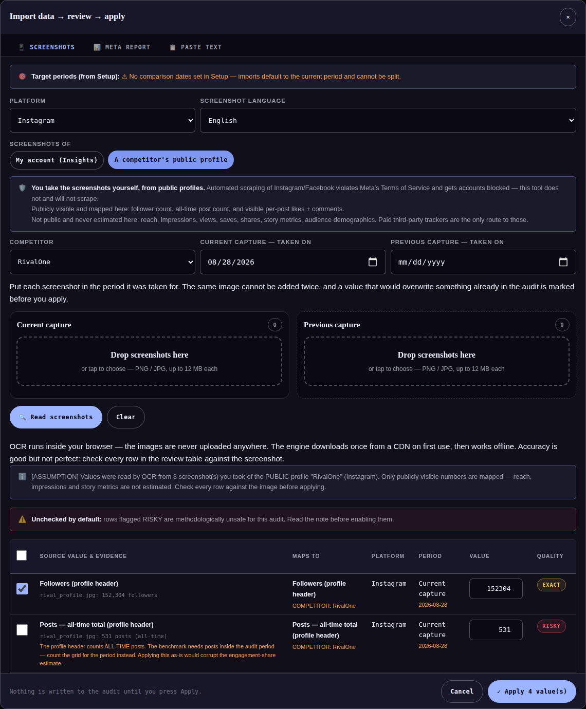

# Competitor capture kit — engineering notes

Shipped 2026-08-28. Roadmap item 5 — **the roadmap's final item**.

## What it is

A **competitor preset in the screenshot importer**: the existing in-browser OCR pointed at
screenshots the user takes of a **public profile**, feeding item 4's competitor tab through the
same review-and-confirm table, the same evidence rules, the same Apply gate.

Honest framing, stated in the UI itself (`comp-kit-honesty` banner): automated scraping of
Instagram/Facebook violates Meta's ToS and gets accounts blocked — this tool does not and will
not scrape; the user supplies the images. Publicly visible and mapped: follower count, all-time
post count, visible per-post likes + comments. Not public and never estimated: reach,
impressions, views, saves, shares, story metrics, demographics — paid third-party trackers are
the only route to those.

## Flow

Data wizard → Screenshots → **"Screenshots of: A competitor's public profile"**. The kit shows:
competitor picker (same-platform competitors + "＋ New competitor…", created **on Apply**, never
before — rule 4), and per-bucket **capture dates** (current defaults to today, editable). The
two drop buckets relabel to *Current capture / Previous capture*. Run OCR refuses to start
without a competitor and a date for every non-empty bucket — undated captures are never
compared, so they can't even be staged.

## Mapping (`ingestCompetitorShots(files, opts)` — per-file)

| Seen on the screenshot | Staged as | Quality |
|---|---|---|
| `152,304 followers` (inline or value-above-label, EN/AR) | followers | EXACT |
| `1.2M followers` | followers | APPROX ("platform-rounded shorthand") — lowercase `24m` refused (timestamp rule) |
| `531 posts` (profile header) | posts | **RISKY, unchecked** — header counts ALL-TIME posts; the benchmark needs posts inside the audit period. Applying as-is would corrupt the engagement-share estimate, and the note says so |
| `348 following` | — | surfaced in Not-mapped (no comparable field), never silently dropped |
| `1,204 likes` per post screen | summed → likes_total | EXACT (APPROX if shorthand) |
| `Liked by X and N others` | N+1 → likes_total | APPROX, inference noted |
| `View all N comments` | summed → comments_total | APPROX (visible count can exclude replies) |
| count of post screens with numbers | sample_posts | EXACT, files named in evidence |

Likes visible on only some sampled posts (hidden likes) → the sum stages **RISKY-off** with
"understates" in the note. Two header readings that disagree become a CONFLICT via the shared
`dedupeFindings` (its key now includes `compId`, so two competitors' same-field rows never
collide).

## Review & apply

Competitor rows render **fixed targets** — no re-mapping/platform/period selects (the wizard's
own controls already decided those); include-checkbox and value stay editable, the overwrite
warning works against the stored snapshot (`existingValue` comp case). Apply writes into
`S.competitors[].cur/prev` **plus `capturedAt`** — provenance stamped at the moment of entry —
and logs `Competitor screenshots` in the provenance card. Competitor data never force-enables a
platform. The dedupe guard that flags previous-period non-metric rows (audience-overwrite
hazard) now exempts `comp` targets: competitor snapshots have a real per-bucket home.

## Tests — `tests/capture-kit.spec.js` (17 × 2 projects → suite 584)

Mapper inputs are constructed strings in the shapes Instagram's public UI prints (same approach
as the paste-mapper tests; the OCR→mapper plumbing is covered by the real-fixture specs).
Header orientations, K/M uppercase rule, following→unmapped, summing + per-post evidence,
liked-by-N-others, hidden-likes RISKY, mixed drops, fixed-target review rows, apply to
cur/prev with dates, create-on-apply exactly once, RISKY row never applied unchecked,
overwrite warning, provenance log + benchmark-card integration, mode UI incl. honesty panel and
per-platform picker filtering, Arabic output.

**Open**: real Tesseract fixtures for public-profile screenshots (needs 2–3 real captures —
same regeneration flow as `tests/fixtures/shots/`).
