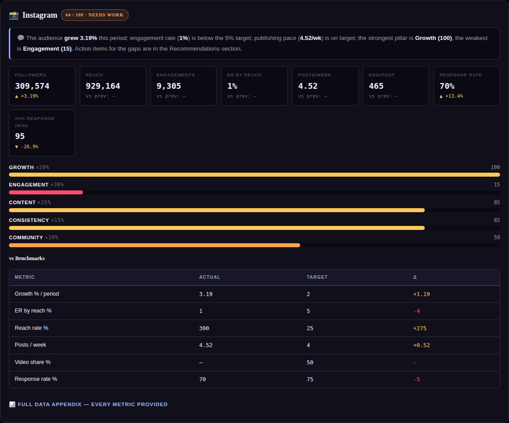

# Community management module — engineering notes

Shipped 2026-08-28. Roadmap item 3.



## What it adds

The brief requires quantified community metrics; until now the tool had only the qualitative
"Comments/DMs answered within 24h" checklist item. New, all manual-entry per period
(step 2, new **Community** section):

| Key | Meaning | Notes |
|---|---|---|
| `dms_received` | DMs / messages received | *enter 0 if none — blank means unknown* |
| `responses_sent` | Responses sent to comments + DMs | |
| `avg_response_time` | Avg response time, minutes | reported with trend, **not scored** |

The comment side of the denominator **reuses the existing `comments` metric** from the
Engagement section — entered once, used twice, so the two can never conflict (rule 8's
CONFLICT case is structurally impossible here).

## Derived

```
inbound        = comments + dms_received          (both must be entered)
response_rate  = responses_sent ÷ inbound × 100   (all three inputs required, inbound > 0)
```

- **Blank blocks the calculation; 0 is a value.** Computing against comments alone while DMs
  are unknown would inflate the rate, so it is refused (`response_rate = null`, listed under
  missing data as "Community response rate (needs comments + DMs received + responses sent)").
- 0 ÷ 0 is not 0% — zero inbound yields no rate.
- A rate above 100% (multiple replies per inbound item) is shown as computed, never capped
  in display; `normScore` caps only the *score* at 100.

## Scoring

New editable benchmark `response_rate` (default placeholder **75%**, same across platforms —
responsiveness is a service standard, not an engagement-index property, so industry presets
pass it through unscaled).

Community pillar:

- **Rate computable** → 60% rate-vs-benchmark + 25% responsiveness qual + 15% comment share
  of engagements.
- **Rate not computable** → the original blend (70% qual + 30% comment share), unchanged.
  Quantitative data extends the pillar; its absence never punishes.

## Report & recommendations

- Scorecard KPI tiles for Response rate and Avg response (min) appear **only when entered** —
  no dash padding. The response-time tile inverts delta coloring (lower is better; the arrow
  still shows the true direction).
- Benchmark table gains a Response rate % row.
- New rule `response_gap` (P1/S): fires when the rate is below the benchmark, with full
  arithmetic evidence (`X responses to Y inbound = comments + DMs`). It **supersedes** the
  qualitative `qual_response` rule whenever the quantitative rate exists, so the two never
  stack on the same theme.
- Executive summary gains a community bullet — `Community response: 350 of 500 inbound
  interactions answered — 70% (target 75%: not met)` — platforms lacking the inputs are
  excluded and named when partial. Candidate bullet count is now 6.

## Ingestion

Manual entry first (per the roadmap). The pasted-text mapper gains exact multi-word synonyms
(`dms received`, `messages received`, `responses sent`, `avg response time` + Arabic) — bare
UI words like Instagram's "Messages" can never be swallowed. CSV template includes the new
keys automatically; `csvTemplate()` now also returns the CSV string (was download-only).

## Tests — `tests/community.spec.js` (27 × 2 projects → suite 508)

Rate math incl. 0-vs-blank and 0÷0; pillar blend arithmetic + fallback; missing-list wording;
KPI tile presence/absence; bench row + editable target; data-step inputs; both rec rules
(fire, don't-fire, supersede, fallback); exec bullet EN/AR + omission; JSON/localStorage
persistence; old-save hydration; Calculations-tab documentation; CSV template; paste mapping.
