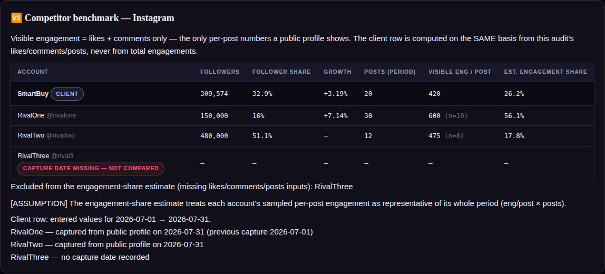

# Competitor benchmark — engineering notes

Shipped 2026-08-28. Roadmap item 4.

## Placement

The roadmap called this a "tab"; it ships as a **Competitors entry card in step 2 (Data)** plus a
**per-platform Competitor benchmark card in the Report**. The six-step structure is load-bearing
(regression-tested, mobile tab bar, print CSS), and competitor entry/output slot naturally into
the existing data-in → report-out flow. Item 5's capture kit will feed this same entry model.

## Data model

`S.competitors[] = { id, name, handle, platform, cur:{...}, prev:{...} }` — one row per
competitor **per platform**. Each capture snapshot holds `capturedAt` (date), `followers`,
`posts` (in the audit period), `sample_posts`, `likes_total`, `comments_total` (across the
sampled posts). Hydration filters malformed rows and unknown platforms; old saves get `[]`.

Only publicly visible quantities have fields — reach, impressions, saves and story metrics do
not, **on purpose**, and the entry card says so.

## The honesty rules (the point of the feature)

1. **Provenance is enforced, not decorative.** A capture holding data but no `capturedAt` is
   listed with a "capture date missing — not compared" chip and every one of its values is
   treated as absent. Each compared competitor gets a printed stamp:
   *"NAME — captured from public profile on DATE (previous capture DATE)"*. The client row's
   stamp is its audit period.
2. **Same basis on both sides.** Visible engagement = likes + comments — the only per-post
   numbers a public profile shows. The client row computes `(likes + comments) ÷ posts` from
   this audit's entered metrics and **never** substitutes total engagements. A client without
   the likes/comments breakdown shows "—" and is excluded (no proxy filling).
3. **Shares only across complete accounts.** Follower share = followers ÷ Σ followers (exact);
   estimated engagement share = (eng/post × posts) ÷ Σ(same), printed with the literal
   `[ASSUMPTION]` that a sample average represents the period. Excluded accounts are named
   under the table. Single-account shares are suppressed (100% of itself is meaningless).
4. **Growth needs two dated captures.** Competitor growth windows differing from the audit
   period by more than `COMP_DAYS_TOLERANCE = 3` days are flagged "≠ days" (tool-set constant,
   documented in Calculations §8) and never feed the recommendation rule.

## Recommendation rule

`competitor_growth_gap` (P2/M): fires when the fastest-growing *unflagged* competitor beats the
client's growth, with both figures and the capture dates in the evidence. No client growth or
no comparable window → silent.

## Tests — `tests/competitors.spec.js` (21 × 2 projects → suite 550)

Stats math (basis parity, exact follower share summing to 100, estimate arithmetic, two-dated-
captures growth, ±3-day flag); provenance enforcement incl. report chip and stamps; no-proxy
exclusions with names; single-account suppression; report card presence/platform isolation;
entry CRUD (add/fill/two-click delete/clear-deletes-key); rec rule fire + three no-fire cases;
JSON + old-save hydration; Arabic render; Calculations documentation.
