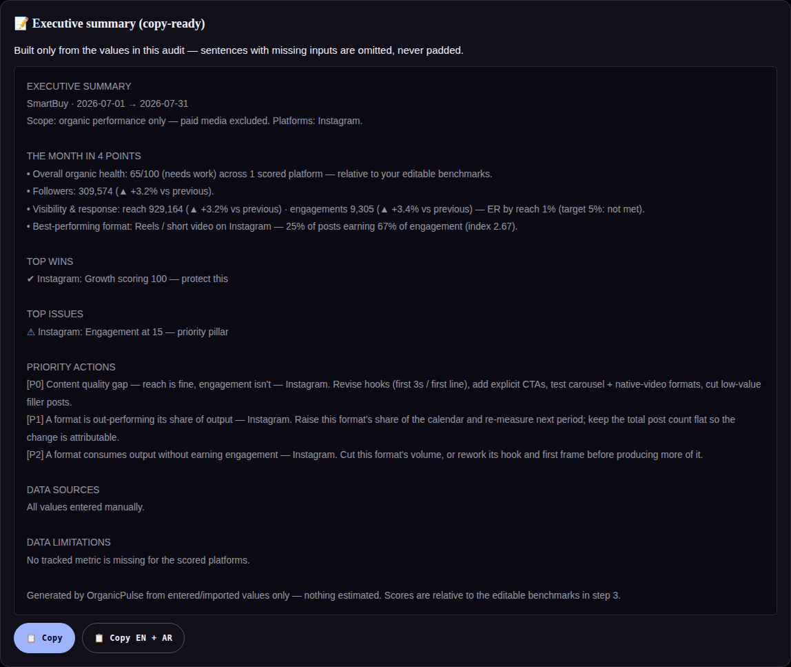

# Executive summary generator (EN/AR) — engineering notes

Shipped 2026-08-06. Roadmap item 2.

## What it does

One card at the top of the Report builds a copy-ready bilingual executive summary — strictly
template-filled from `S` and derived values. It follows the agency monthly-report template
(`monthly_report_template.md` in the project): header + scope, "the month in N points", top wins,
top issues, priority actions, data sources, data limitations, and an honesty footer.

`buildExecSummary(lang) → { text, bullets }` is pure (no DOM, no state writes) and is called
fresh per render and per copy, so EN and AR are always built from the same state.

## Gating

The summary renders only when **≥ 2 headline bullets** could be built. Candidate bullets:

1. Overall health — average of `scorePlatform(p).overall` across scoreable platforms, with the
   band label and the explicit caveat *"relative to your editable benchmarks"*.
2. Followers — combined across platforms with a per-platform breakdown when > 1.
3. Visibility & response — reach · engagements · ER by reach, plus benchmark target met/not-met
   when a single platform is scoped.
4. Best-performing format — highest format index, only when ≥ 2 format rows exist.
5. Archived trajectory — first → last follower total, only when ≥ 2 archived months for the
   active client.

Fewer than two → an empty state (`exec-summary-empty`). A one-metric audit never produces a
padded "summary".

## Integrity rules applied (the point of the feature)

- **A sentence with a missing input is omitted, never padded.** No reach → no visibility
  sentence. No archive → no trajectory sentence. Tested negatively.
- **Combined deltas require completeness:** a cross-platform delta prints only when *every*
  counted platform has both periods — otherwise the sum prints without a delta rather than
  comparing unlike sets.
- **Priority actions are never free-written.** They are the top 3 of `buildRecs()` — each line
  is a triggered, evidence-backed rule: `[P0] title — platform. action`.
- **Data sources** come from `S.importLog` (source × count); a fully manual audit says
  *"All values entered manually."*
- **Data limitations are never hidden:** the union of `scorePlatform(p).missing` is printed
  ("N metric(s) not provided and excluded from scoring — never guessed: …").
- Footer states the provenance rule: built from entered/imported values only, nothing
  estimated, scores relative to editable benchmarks.

## Copy behaviour

- **Copy** — the active language's text via `navigator.clipboard`, with a hidden-textarea
  `execCommand` fallback (the file also runs from `file://` where clipboard may be denied).
- **Copy EN + AR** — both languages joined by a 24-em-dash separator, for bilingual client
  emails.
- Buttons are `.no-print`; the summary text itself prints with the report (it is part of the
  deliverable).

## Tests — `tests/exec-summary.spec.js` (21 × 2 projects)

- Gating: empty audit, one-bullet audit (still empty state), two-bullet render.
- Template filling: every figure traces to a seeded value or documented derivation; no
  `undefined`/`NaN` ever; no delta without a previous period; combined totals sum only provided
  values; combined delta withheld when one platform lacks previous.
- Omission: reach/format/health sentences absent when their inputs are.
- Actions: `[P…]` lines ≤ 3 and exactly `min(3, triggered)`, platform named; TOP ISSUES on a
  collapsing pillar; TOP WINS on an excelling one.
- Provenance: manual wording vs `Pasted text ×1` after a real paste import.
- Copy: clipboard payload equals the rendered text; EN+AR contains both languages.
- Arabic render, print classes.
